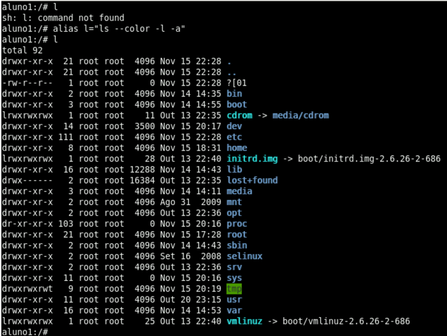
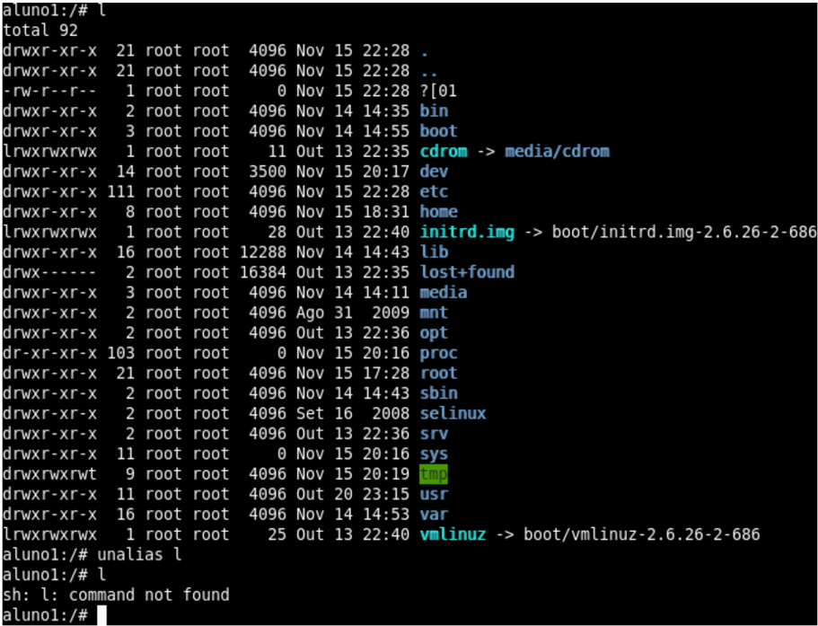

## 11

## Arquivos de configuração do shell

Alguns arquivos são automaticamente lidos pelo shell no momento do login e do logout de um usuário ou ainda no momento da chamada do shell a partir de uma sessão que já tenha sido iniciada. Dependendo de como for iniciado o bash, arquivos diferentes serão executados de forma automática e, a partir desse conhecimento, o usuário pode programar a criação de variáveis, aliases, funções e outras personalizações do bash.

Caso o bash seja invocado durante um login, ele lerá os arquivos /etc/profile , ~/.bash\_profile , ~/.bash\_login e ~/.profile , nessa ordem, caso eles existam. O primeiro aplica-se a todos os usuários do sistema, ao passo que os três últimos, ocultos por iniciarem com um ponto ( . ), estão no diretório /home do usuário em questão. Ao terminar a sessão, o bash executará automaticamente o arquivo ~/.bash\_logout , se ele existir.

Quando não se tratar de um shell invocado numa sessão de login, como é o caso de terminais em sessões X, os arquivos executados automaticamente, caso existam, serão o /etc/bash.bashrc e ~/.bashrc .

Vejamos separadamente alguns arquivos de configuração importantes.

## Arquivo /etc/profile :

O arquivo /etc/profile é executado automaticamente no momento do login e lido antes dos arquivos de configurações pessoais do usuário. É responsável, ainda, por definir as variáveis de ambiente para os usuários em geral e armazenar os comandos a serem executados, quando

o usuário efetuar o login no sistema. Sempre que o arquivo for carregado por meio de um shell que solicita login, ele procurará os arquivos na sequência descrita no início deste tópico e realizará a execução dos comandos nele contidos, caso eles existam.

Arquivo /etc/environment :

O arquivo /etc/environment é utilizado por sistemas Debian para definir variáveis de ambiente. Uma vez definidas, todas as variáveis são exportadas, automaticamente, na inicialização do sistema. Esse arquivo substitui o arquivo /etc/profile em algumas distribuições.

Arquivo /.bashrc :

Executado por shells invocados em sessões já iniciadas, e não de login, esse arquivo possui características semelhantes às do arquivo ~/.bash.profile .

## Utilização de aliases (apelidos)

Alguns comandos têm uma sintaxe indiscutivelmente grande e digitá-la inteira toda vez que o comando for necessário tende a se tornar uma tarefa inconveniente, especialmente quando o comando é usado diversas vezes com os mesmos argumentos e opções.

Uma forma bastante útil de agilizar a entrada de um comando que seja usado normalmente com os mesmos parâmetros é atribuir um alias, que provém da palavra apelido em inglês. Em linha de comando ou em um arquivo próprio para isso, atribui-se um termo pequeno e de digitação fácil para executar um determinado comando com parâmetros específicos toda vez que este alias for usado.

No exemplo a seguir, executamos propositalmente l , que é um comando inexistente. Em seguida, com o comando alias, especificamos que ao digitar l o comando a ser executado será igual a ls --color -l -a . Então, ao executarmos novamente o comando l , ele passa a responder como o comando ls e com os parâmetros --color -l -a **.

Isso será particularmente útil para administradores de sistema, por exemplo, que precisam executar comandos específicos diariamente, consultar processos em execução etc., de forma que seja possível automatizar o trabalho, ou pelo menos, torná-lo menos moroso.



Para remover o alias de um comando, utiliza-se o comando unalias , como mostra este exemplo da figura a seguir, que exclui o alias l criado no exemplo anterior:



## Arquivos para exibição de mensagens

Existem três arquivos relacionados à exibição de imagens para usuários, que não afetam a parte operacional do sistema. O primeiro deles é o /etc/issue , que exibe uma mensagem para um usuário antes do login no sistema. Caso queira que a mensagem apareça depois do login, o arquivo utilizado é o /etc/motd . Para visualizar mensagens exibidas em logins remotos, o arquivo a ser verificado é o /etc/issue.net .

Arquivo .bash\_history :

O .bash\_history é um arquivo responsável por armazenar o histórico de linhas de comando. Por padrão, até 500 comandos podem ser armazenados nesse arquivo, que pode ser verificado por comandos que exibem o seu conteúdo. Por meio das setas direcionais no teclado, para cima e para baixo, podemos verificar quais comandos já foram utilizados.

O arquivo .bash\_history também armazena sua configuração em algumas variáveis. Vejamos

quais são elas na tabela abaixo:

| Variável                               | Descrição                                                                                                                                                                                                       |
|----------------------------------------|-----------------------------------------------------------------------------------------------------------------------------------------------------------------------------------------------------------------|
| HIST- FILE HIST- SIZE HIST- FILE- SIZE | Armazena o nome do arquivo utilizado para armazenar históricos. Armazena o número máximo de comandos que o arquivo suportará. Armazena o número máximo de linhas que o arquivo do histórico comandos suportará. |

## Histórico de comando

Do ponto de vista prático, esse recurso traz grande praticidade ao usuário, pois não é necessário redigitar diversas vezes um mesmo comando.

Para manter o histórico dos comandos utilizados, basta digitar history na linha de comando e então ENTER . Por meio das teclas direcionais para cima e para baixo do teclado, temos acesso ao histórico. Veja um exemplo da execução do comando history :

```
history 93 su 94 lpsci 95 sudo -s 96 aptitude search chromium 97 history
```

No exemplo a seguir, utilizamos o comando history para exibir os últimos 10 comandos digitados:

```
history 10 493 reset 494 set | grep LOCAL 495 set | grep GLOBAL 496 echo $GLOBAL 497 set | grep LOCAL 498 unset LOCAL 499 set | grep LOCAL 500 sudo -s 501 df -h 502 history 10
```

## Comando fc

FC significa Find Command ou Fix Command pois ele executa as duas tarefas, encontrar e corrigir comandos. Para listar os comandos já digitados, guardados no history , digite:

fc -l

Por padrão mostra os últimos 16 comandos. Para visualizar uma lista de comandosdo 2 ao 6 faça:

fc -l 2 6

Para visualizar os ultimos 20 comandos:

fc -l -20

Para visualizar todos os comandos desde o ultimo comecando com h:

fc -l h