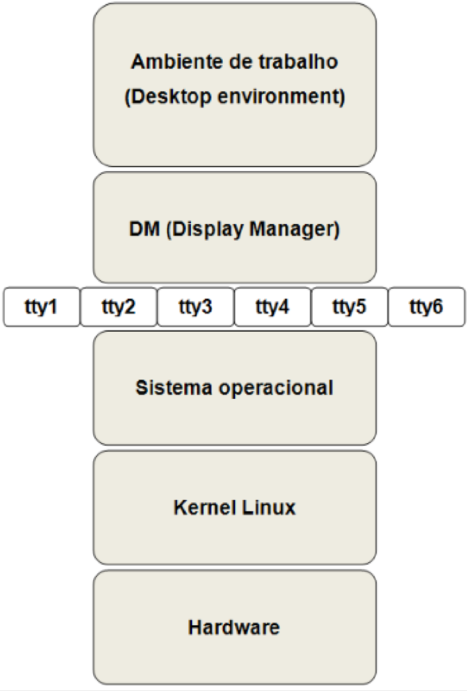
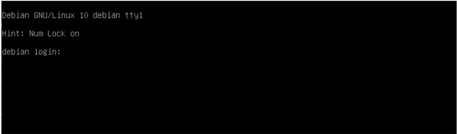

8

## Estrutura do sistema operacional

A estrutura de um sistema GNU/Linux é composta por porções denominadas camadas ( layers ). A figura a seguir demonstra a estrutura em camadas do sistema operacional GNU/Linux :



Para compreender de fato o que é esse sistema, é fundamental saber do que se trata cada uma de suas camadas. Vejamos:

- Ambiente de trabalho (desktop environment) : hospeda todos os programas cujo funcionamento depende de um ambiente gráfico;
- DM (display manager) : aqui são gerenciados os logins na interface gráfica e selecionado o tipo de ambiente gráfico que será executado;
- ttyn : terminais virtuais que interpretam os comandos introduzidos por um usuário e os convertem para uma linguagem inteligível pelo computador. Nessa camada os comandos são executados e as configurações são definidas;
- Sistema Operacional : camada que auxilia e hospeda todos os aplicativos das camadas superiores, mencionadas anteriormente;
- Kernel Linux : mediadora entre as camadas superiores e o hardware, essa camada é o núcleo do sistema operacional;
- Hardware : camada que compreende os dispositivos do sistema disponíveis para uso, como CD-ROM, teclado, monitor, entre outros.# Introdução

## Sessões

Uma sessão é composta pelos dados gerados após o login de um usuário válido cadastrado no sistema e efetuado com sucesso no ambiente. Esse login dará acesso direto ao interpretador de comandos padrão determinado no sistema, que geralmente será o bash. As sessões são iniciadas através dos terminais, que são caracterizados como terminal virtual somente em modo texto ou pseudoterminal inicializado a partir de um ambiente gráfico. A única diferença entre eles é a forma de acesso. A seguir, falaremos sobre esses terminais.

## Terminal virtual em modo texto

O conjunto teclado/monitor conectado à máquina compreende o que chamamos de terminal, ou console. Por meio de terminais virtuais, o GNU/Linux permite que diversos usuários se mantenham simultaneamente conectados, pondo em prática o aspecto multiusuário/multitarefa, característico do padrão Unix.

Com programas como rlogin , ssh , rsh , rdesktop e telnet , podemos acessar terminais virtuais remota ou localmente.

Um terminal virtual em modo texto é prático e rápido, pois não é necessário esperar o ambiente gráfico carregar para iniciar uma sessão a partir do mesmo. Geralmente, em servidores, o recurso de ambiente gráfico não está habilitado. Em casos como esse, assim que o processo de inicialização do sistema for concluído, o primeiro terminal estará disponível aguardando um login para o início de uma sessão.

É possível ter acesso a outros terminais que trabalham de forma completamente independente. O GNU/Linux apresenta precisamente 63 terminais em modo texto, mas, por questões de consumo de memória RAM, somente 6 são disponibilizados por padrão.

Para acessá-los é muito simples. Basta manter pressionada a tecla ALT e, em seguida, pressionar a tecla de função correspondente ao terminal que desejamos acessar (teclas F1 até F6). Se estivermos no primeiro terminal, temos o seguinte:

| Terminal   | Nome   | Tecla de atalho para acesso   |
|------------|--------|-------------------------------|
| Primeiro   | tty1   | (CTRL +) ALT + F1             |
| Segundo    | tty2   | (CTRL +) ALT + F2             |
| Terceiro   | tty3   | (CTRL +) ALT + F3             |
| Quarto     | tty4   | (CTRL +) ALT + F4             |
| Quinto     | tty5   | (CTRL +) ALT + F5             |
| Sexto      | tty6   | (CTRL +) ALT + F6             |

Nota sobe CTRL + ALT +F(n): caso o terminal padrão não seja um terminal em modo texto, é preciso utilizar também a tecla ALT.

Teremos então, na primeira linha, o nome e a versão do sistema operacional, o nome do computador e o nome do terminal em que estamos localizados. Na figura que mostra o terminal a seguir, temos Debian GNU/Linux 10 debian tty1 :



## Onde:

- Debian GNU/Linux 10 é o nome e a versão do sistema operacional;
- debian é o nome da máquina;
- tty1 indica o primeiro terminal.

## Pseudoterminal

Um pseudoterminal é, basicamente, um terminal virtual inicializado a partir do ambiente gráfico. Tem a mesma função do terminal em modo texto, porém depende da execução do ambiente gráfico para que seja carregado. Os gerenciadores de janelas, como o KDE ou

o GNOME, têm aplicações específicas que emulam um terminal no ambiente gráfico, como konsole no KDE, ou o próprio terminal no GNOME.

## Execução dos primeiros comandos

Vejamos, a seguir, como executar os primeiros comandos a partir do shell do GNU/Linux, a fim de iniciar e encerrar uma sessão, desligar e reiniciar o sistema e obter ajuda a respeito da utilização de comandos.

## Início de uma sessão (login)

Depois de conhecer melhor os terminais, que são a porta de entrada para o sistema, é hora de iniciar uma sessão em modo texto (fazer o login), pois esta exigirá, em um sistema configurado de modo seguro, que seja feita uma autenticação com um usuário previamente cadastrado. Em qualquer um dos terminais virtuais em modo texto, basta inserir o login e a senha, lembrando-se da característica case-sensitive presente no sistema. Então, a sessão é iniciada, como mostrado na figura a seguir:

Assim que a autenticação for executada com sucesso, o prompt principal do interpretador de comandos utilizado é apresentado, e o sistema já pode ser operado.

Sobre o prompt principal citado anteriormente, teremos muitas informações caso o interpretador de comandos seja o bash. Caracteres como , , : , -e @ são utilizados apenas para separar informações e formar o prompt principal. O caractere $ identifica que o usuário atual não tem permissões ou poderes de superusuário para executar determinadas operações .

username@mycomputer:~$

Para executar comandos com poderes administrativos, temos várias maneiras e uma delas é alterar o nível de usuário de comum para superusuário. Para isso, podemos utilizar o comando sudo -i . Ao digitar sudo -i na linha de comando e teclar ENTER , é solicitada a senha de seu usuário.

```
username@mycomputer:/$ sudo -i Senha: root:/#
```

Outra maneira, seria alterar o login para o usuário root :

```
username@mycomputer:/$ su Senha: root:/#
```

O comando su -( substitute user ), tem a finalidade de alterar a sessão para outro usuário, neste caso como não informamos nenhum após o -, por padrão será o usuário root .

Em vez de um $ , teremos o caractere # , indicando que o usuário agora é um superusuário.

Existem dois comandos, whoami e who am i que lhe permite saber quem você é em determinado momento. A sequência de comandos abaixo esclarece o uso e finalidade destes dois comandos claramente:

```
whoami who am i
```

O comando whoami indica quem você é no momento root . Se você utilizou o comando su para tornar-se outro usuário o comando whoami informa quem você realmente é aluno , pois foi com ele que você se logou na máquina antes de trocar de usuário.

Ele também pode ser utilizado para trocar de usuário, ele não pedirá a senha se você for usuário root :

```
su - aluno
```

Todas essas informações sobre o prompt principal poderão ser alteradas através de variáveis

de ambiente.

## Encerrando uma sessão (logout)

Após uma sessão em modo texto ser inicializada, é possível fechá-la (fazer o logout) com os comandos logout ou exit . A seguir veja o shell com o comando exit digitado:

username@mycomputer:~$ exit

A sequência de teclas CTRL + D também pode ser utilizada para finalizar uma sessão.

## Desligamento do sistema

Sob o nível de usuário root , o desligamento do computador pode ser realizado por um dos seguintes comandos:

shutdown -h now ou:

halt -p ou:

poweroff ou:

init 0

Ainda que o computador possa ser desligado diretamente pelo botão liga/desliga, sem a utilização de nenhum dos comandos citados, esse procedimento deve ser evitado sempre que possível, pois os programas que não forem fechados e os dados não gravados podem gerar falhas no sistema de arquivos e perda de dados.

Dessa forma, para garantir a segurança do sistema, o usuário deve escolher um dos três comandos de desligamento disponíveis, que automaticamente executam esses processos de encerramento da maneira adequada. Salvar manualmente os arquivos antes do desligamento e considerar o uso de um nobreak são outras medidas de segurança possíveis.

O comando shutdown poderá ser utilizado para desligar ou reiniciar o sistema.

Para desligar o sistema, utiliza-se a sintaxe shutdown -h &lt;tempo&gt; , onde &lt;tempo&gt; define o momento (em minutos) em que ocorrerá o desligamento e h significa halt ou seja, desligar o sistema.

Para desligar o sistema imediatamente, digitamos o comando now (agora) conforme a seguinte linha:

```
shutdown -h now
```

Ao utilizar o parâmetro now , os processos atualmente executados são encerrados antes do desligamento da máquina. Outro meio de desligar o sistema imediatamente é utilizar o valor 0 (zero).

```
shutdown -h 0
```

Para desligar o sistema daqui a 10 minutos, por exemplo, digitamos o seguinte:

```
shutdown -h 10
```

Para desligar o sistema exatamente às 17:00, por exemplo, digitamos o seguinte:

```
shutdown -h 17:00
```

Os comandos halt ou poweroff também podem ser utilizados para desligar o sistema de forma simples e direta, mas sem a opção de poder especificar o tempo. Em computadores antigos, o usuário precisará apertar o botão liga/desliga, quando a mensagem power down aparecer, após o envio do comando halt .

## Reiniciar o sistema

É recomendável não reiniciar o sistema através dos botões liga/desliga e RESET, pois, como já mencionado, o desligamento abrupto do computador pode causar não só a perda de dados não salvos adequadamente, mas também falhas nos sistemas de arquivos. Existem comandos específicos para reiniciar o sistema de forma segura, e os botões citados devem ser evitados e usados somente em último caso.

Para reiniciar o sistema, podemos utilizar, como no desligamento, o comando shutdown . No entanto, utilizamos o parâmetro -r (proveniente de reboot ) em vez de -h , como mostra esta sintaxe:

```
shutdown -r <tempo>
```

Omomento em que deve ocorrer a reinicialização deve ser especificado em &lt;tempo&gt; . No exemplo a seguir, o comando shutdown reiniciará o sistema daqui a 10 minutos:

```
shutdown -r 10
```

Para reiniciar imediatamente o sistema, digitamos a seguinte linha:

```
shutdown -r now
```

O comando reboot ou a sequência de teclas CTRL + ALT+ DEL também pode ser utilizado de forma simples para reiniciar o sistema, mas sem a opção de poder especificar o tempo. Antes de reiniciar o sistema, todos os arquivos abertos devem ser salvos, para evitar acidentes.