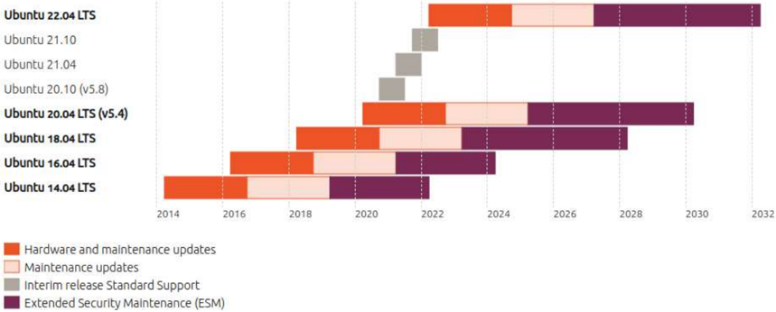

## 5

## Evolução do Linux: distribuições

Com a junção das ferramentas GNU e o kernel Linux, temos tecnicamente um sistema operacional GNU/Linux. Em suas primeiras versões, instalar um sistema GNU/Linux era extremamente complexo, pois era necessário praticamente instalar e compilar manualmente quase todas as ferramentas, incluindo o próprio kernel. Ou seja, o GNU/Linux era geralmente utilizado por usuários avançados. Foi a partir dessa dificuldade que surgiram as primeiras distribuições GNU/Linux - também chamadas de distros -, que tinham a finalidade de facilitar a instalação do sistema, disponibilizando todas as ferramentas necessárias, com um kernel Linux e um instalador para automatizar o processo de instalação. Tudo isso era disponibilizado através de um CD, disquete ou outro tipo de mídia. Uma distribuição Linux é um pacote que consiste em um kernel Linux, mais uma seleção de aplicativos mantidos por uma empresa ou comunidade de usuários. O objetivo de uma distribuição é otimizar o kernel e os aplicativos que são executados no sistema operacional para um determinado tipo de uso ou grupo de usuários. As distribuições frequentemente incluem ferramentas próprias para a instalação de software e administração do sistema. Por essa razão, certas distribuições são usadas principalmente em ambientes desktop, por serem mais fáceis de usar, enquanto outras são mais comumente instaladas em servidores para usar os recursos disponíveis da maneira mais eficiente possível. Hoje existe uma quantidade imensa de distribuições disponíveis para instalação, com pratica- mente todos os níveis de dificuldade e usos específicos.

Em 1993, Patrick Volkerding reuniu o kernel Linux e diversos aplicativos, dando origem à distribuição denominada Slackware, tida como a primeira a ser disponibilizada de forma pública, em CDs já pré-compilados e prontos pra instalação por qualquer usuário em qualquer tipo de computador.

A maioria das distribuições existentes hoje em dia são ramificações da Slackware e de outras três distribuições: Debian, Red Hat e SUSE. As mais antigas e tradicionais são Slackware e Debian, que surgiram em meados de 1993.

No site DistroWatch.Com (distrowatch.com), é possível conferir a lista de distribuições existentes, bem como notícias e últimas atualizações de cada uma delas. O site também disponibiliza links para aquisição das distribuições.

## Distribuições livres e corporativas

A maioria das distribuições é mantida por comunidades de colaboradores localizados em todo o mundo e por corporações. Dada essa característica, as distribuições podem ser divididas em duas categorias: livres e corporativas. O primeiro tipo é disponibilizado por comunidades de colaboradores que não visam absolutamente nenhum lucro sobre suas distribuições, como é o caso do Slackware, Debian, Knoppix, Gentoo e CentOS.

Dentro das distribuições livres, subdividem-se ainda as convencionais, tradicionalmente distribuídas em algum tipo de mídia para instalação em disco rígido, e as distribuições Live, cuja execução se dá a partir da própria mídia, sem instalação no HD e, portanto, sem risco ao sistema operacional original da máquina no qual está sendo executada. Quase todos os componentes do sistema já vêm previamente configurados numa distribuição Live, o que a torna conveniente e fácil de usar. A Knoppix é um exemplo bem conhecido de distribuição Live, e dele surgiram o Kurumin e o Kalango, já traduzidos para o português e adaptados à nossa realidade.

Já as distribuições corporativas, como Ubuntu, Suse, Red Hat e Mandriva, são administradas por empresas que cobram pelo suporte prestado. É importante notar que, embora um custo esteja envolvido, isso não contradiz os princípios da licença GPL, pois a liberdade de software é mantida. Qualquer usuário tem acesso ao código-fonte das distribuições corporativas, de forma que, o que é vendido não é o produto, mas uma prestação de serviço de assistência e suporte caso estes se façam necessários.

## Distribuições from scratch e derivadas

As distribuições também podem ser categorizadas de acordo com a maneira como são desenvolvidas. Assim, são classificadas como from scratch (do zero) ou derivadas de alguma outra

distribuição.

A diferença básica entre os dois tipos é que as distribuições from scratch não derivam de nenhuma já existente, sendo todas as suas características desenvolvidas específica e exclusivamente para elas, como é o caso da Debian, Red Hat, Slackware e Gentoo, enquanto as derivadas baseiam-se em alguma distribuição anterior, recebendo ajustes e visando um objetivo funcional definido. Exemplos desse tipo são os mencionados Kubuntu e Kurumin, além de Ubuntu, DreamLinux, BrDesktop e Slax.

Muitas distribuições independentes foram lançadas ao longo dos anos. Algumas delas se baseiam em Red Hat ou Ubuntu, outras são projetadas para aprimorar uma propriedade específica de um sistema ou hardware. Existem distribuições construídas com funcionalidades específicas, como o QubesOS, um ambiente de desktop extremamente seguro, ou o Kali Linux, que oferece um ambiente para explorar vulnerabilidades de software e é usado principalmente para testes de invasão. Recentemente, diversas distribuições Linux minúsculas foram projetadas para serem executadas especificamente em containers Linux, como o Docker. Existem também distribuições construídas especificamente para componentes de sistemas embarcados e até mesmo para dispositivos inteligentes.

## Red Hat Enterprise Linux

A distribuição Red Hat Linux, criada em 1993, é pioneira em distribuições GNU/Linux corporativas. Tem grande aceitação por parte das empresas pelo fato de oferecer suporte técnico e grande compatibilidade com as tecnologias mais utilizadas, tendo conquistado no mercado corporativo o posto de uma das maiores produtoras de soluções open source do mercado. Sua interface gráfica padrão é a GNOME e utiliza o sistema de pacotes RPM ( RedHat Package Manager ) para a instalação de aplicativos.

Derivada da Red Hat Linux, a Red Hat Enterprise Linux é uma versão corporativa de distribuição original. Outro projeto relacionado é o Fedora Project, projeto patrocinado pela Red Hat, cuja proposta é ser uma distribuição para a comunidade. O CentOS é uma derivação idêntica ao Red Hat Enterprise Linux até sua versão 8. Veremos mais detalhes sobre isso em tópico posterior.

Vale ressaltar que a Red Hat possui algumas das mais conceituadas certificações Linux, focadas exclusivamente em seus produtos.

Para mais informações sobre essa distribuição, acessar https://www.redhat.com.

## CentOS

O CentOS, abreviação de Community Enterprise Operating System , é uma distribuição Linux de classe corporativa derivada de códigos fonte gratuitamente distribuídos pela Red Hat En-

terprise Linux e mantida pelo CentOS Project. Esta distribuição sempre foi uma alternativa para empresas que não desejam pagar por uma distribuição fechada, mas esse cenário pode mudar com o anúncio da desativação do projeto CentOS em 2021 e a mudança de foco para o projeto CentOS Stream, onde teremos uma distribuição para mostrar o que está por vir no Red Hat Linux. A numeração das versões sempre foi baseada na numeração do Red Hat Enterprise Linux. Por exemplo, o CentOS 7 é baseado no Red Hat Enterprise Linux 7, mas com a chegada do CentOS Upstream isso mudará, pois será uma distribuição do tipo rolling release (lançamento contínuo) sem lançamento de versões finais.

Embora o CentOS seja bem visado para seu uso em servidores devido a sua estabilidade e robustez, ele não é um sistema exclusivo de servidores. Tem essa fama devido ao seu foco em recursos estáveis (semelhantes ao que o Debian GNU/Linux faz) e as aplicações são focadas em estações de trabalho e redes por padrão. Ele pode ser usado para uso comum, porém, é necessário incluir nele os repositórios adicionais que não vem ativos por padrão. Os mais comuns são: RPMFusion e EPEL.

A partir do CentOS 5, cada versão é suportada por 10 anos (por meio de atualizações de segurança, assim como as versões anteriores eram suportadas por 7 anos). Uma nova versão do CentOS é lançada aproximadamente a cada 2 anos e cada versão do CentOS é atualizada regularmente aproximadamente a cada 6 meses, para oferecer suporte a hardware mais recente. Isso resulta em um ambiente seguro, de baixa manutenção, confiável, previsível e reproduzível. Como o RHEL exige que os usuários comprem uma licença, alguns preferem optar pelo CentOS, que fornece atualizações gratuitamente. Uma das desvantagens é que os lançamentos do CentOS sempre demoram um pouco mais do que os lançamentos do RHEL para serem disponibilizados enquanto a comunidade testa os pacotes e faz alterações de marca e similares.

Este ciclo está em processo de mudança, devido ao foco no novo projeto CentOS Stream.

Fonte: https://wiki.centos.org/About

O CentOS Stream servirá como o ramo upstream (desenvolvimento) do Red Hat Enterprise Linux.

O CentOS 8 terá seu suporte encerrado em 31 de Dezembro de 2021.

O CentOS 7 terá seu suporte encerrado em 30 de Junho de 2024, mantendo assim o ciclo de suporte RHEL 7.

A Red hat orienta aos usuários do CentOS 8 a realizar a mudança para o Centos Upstream quando o suporte acabar:

' Quando o CentOS Linux 8 (a reconstrução do RHEL8) terminar, sua melhor opção será migrar para o CentOS Stream 8, que é um pequeno delta do CentOS Linux 8 e tem atualizações regulares como as versões tradicionais do CentOS Linux. Se você estiver usando o CentOS Linux 8 em um ambiente de produção e estiver preocupado com o fato de o CentOS Stream não atender às suas necessidades, recomendamos que você entre em contato com a Red Hat sobre as opções disponíveis. '

Para mais informações sobre essa distribuição, acessar www.centos.org .

## Oracle Linux

A Oracle Linux é uma distribuição Linux empacotada e distribuída gratuitamente pela Oracle, disponível parcialmente sob a GNU General Public License desde o final de 2006. É compilada a partir do código-fonte do Red Hat Enterprise Linux (RHEL), substituindo a marca Red Hat pela Oracle.

Oferece acesso a algumas das inovações mais avançadas do Linux, como Ksplice (extensão do Kernel Linux que permite que patches de segurança sejam aplicados a um kernel em execução sem a necessidade de reinicializações), e DTrace (estrutura de rastreamento dinâmico abrangente criada originalmente pela Sun Microsystems para solucionar problemas de kernel e de aplicativo em sistemas de produção em tempo real).

Para mais informações sobre essa distribuição, acessar www.oracle.com/linux.

## Slackware

Criada por Patrick Volkerding, a distribuição livre Slackware Linux foi a primeira a ser distribuída em CD e é um sistema Unix-like multitarefa completo de 32-bits. Utiliza o sistema de pacotes tgz , orientado por menus, e sua interface padrão é a KDE. É compatível com 486 sistemas, incluindo os servidores x86 mais modernos, possui extensa documentação online e um programa de instalação fácil de usar.

A instalação completa da Slackware proporciona ao usuário o Sistema X, os ambientes de desenvolvimentos C/C++, o Perl, um servidor de notícias, um servidor de e-mail, um servidor

web e um servidor FTP. Possui ainda o GNU Image Manipulation Program , o navegador Mozilla Firefox, utilitários de rede, além de muitos outros programas.

Para mais informações sobre essa distribuição, acessar www.slackware.com.

## Debian GNU/Linux

Com interface padrão Xfce, a distribuição livre Debian é atualmente uma das maiores distribuições e uma das principais bases para outras distribuições derivadas. Faz uso do sistema de pacotes DEB - Debian Package e é executada em quase todos os computadores pessoais, inclusive os mais antigos, sendo que cada nova versão normalmente fica compatível com mais máquinas.

A Debian, criada em 1993 por Ian Murdock, foi uma das primeiras distribuições criadas, com o intuito de ser desenvolvida abertamente, seguindo os moldes do Linux em si. Embora possa ser baixada virtualmente e instalada normalmente com uma conexão rápida, é tradicionalmente distribuída para instalação em CDs, que podem ser comprados pelo preço somente da mídia.

Para mais informações sobre essa distribuição, acessar www.debian.org.

## Ubuntu

Baseado no Debian, o Ubuntu, cujo nome significa ' Humanidade para os outros ' ou ' Sou o que sou pelo que nós somos ' em africano, conta com diversas ferramentas, como servidores web, ferramentas de programação, processador de texto e leitor de e-mails. Distribuído de forma convencional e Live, o Ubuntu é usado em laptops, desktop e servidores, e esses dois últimos contam com atualizações de segurança gratuitas por, no mínimo, 18 meses.

O Ubuntu, que utiliza o sistema de pacotes DEB, serviu de derivação para outras distribuições, como Kubuntu, Xubuntu e Lubuntu, só para citar algumas. Sua interface padrão é a GNOME ou KDE. Esta última é adotada pela distribuição Kubuntu.

As versões LTS ou ' Long Term Support ' são publicadas a cada dois anos, no mês de abril. As versões LTS são as versões de 'nível empresarial' do Ubuntu e são as mais utilizadas. Estima-se que 95% de todas as instalações do Ubuntu sejam lançamentos LTS.

A cada seis meses entre as versões LTS, a Canonical publica uma versão provisória do Ubuntu, sendo a versão 20.10 o exemplo mais recente. Essas são versões de qualidade de produção e são suportadas por 9 meses, com tempo suficiente fornecido para os usuários atualizarem, mas essas versões não recebem o compromisso de longo prazo recebido das versões LTS.

Os lançamentos provisórios apresentam novos recursos de projetos de código aberto da Canonical e upstream, e servem como um campo de testes para esses novos recursos. Muitos desenvolvedores executam lançamentos provisórios porque fornecem compiladores mais novos ou acesso a kernels e bibliotecas mais recentes e são frequentemente usados em processos de DevOps rápidos, como pipelines de CI/CD, onde a vida útil de um artefato é provavelmente menor do que o período de suporte do lançamento provisório. Versões provisórias recebem manutenção de segurança total para a árvore principal ( main ) do projeto durante sua vida útil.

Para mais informações sobre essa distribuição, acessar www.ubuntu.com.

## Linux Mint

Mint é uma distribuição derivada e compatível com o Ubuntu. Possui duas versões: uma baseada em Ubuntu (com o qual é totalmente compatível e partilha dos mesmos repositórios) e outra versão baseada em Debian. Suporta muitos idiomas, incluindo a língua portuguesa e utiliza o Cinnamon como seu principal ambiente de desktop. Esforça-se para ser um 'sistema operacional moderno, elegante e confortável, além de poderoso e fácil de usar' e possui suporte multimídia pronto para o uso, incluindo alguns softwares proprietários e vem com uma variedade de aplicativos gratuitos e de código aberto. O Linux Mint diferencia-se do Ubuntu e do Debian por incluir drivers e codecs proprietários por padrão e por alguns recursos que permitem fazer através da interface gráfica (GUI Graphical User Interface ) configurações que em ambos os sistemas são feitas através do modo texto (CLI Command Line Interface ). Utiliza por padrão o desktop Cinnamon, um derivado do GNOME, com um menu no painel inferior junto à barra de tarefas (o MintMenu), similar ao menu do KDE ou o menu 'Iniciar' do Windows. O propósito da distribuição é providenciar um sistema Linux que funcione 'out-of-the-box', isto é, que esteja pronto para uso assim que terminada sua instalação.

Para mais informações sobre essa distribuição, acessar www.linuxmint.com.

## Fedora

Outro sistema operacional baseado em Linux é o Fedora, de distribuição livre. Tem como interface padrão a GNOME e o gerenciamento de pacotes é feito de forma padrão pelo gerenciador de pacotes YUM. O YUM automaticamente baixa e gerencia a instalação do que for exigido pelo sistema, administrando pacotes instalados, atualizando ou removendo pacotes desnecessários.

Patrocinado pela Red Hat, o Fedora tem uma média de lançamento de versões novas a cada seis meses pelo Fedora Project, que é uma parceria formada por membros da comunidade de Software Livre. Diversas aplicações estão disponíveis para essa distribuição, como players de vídeo e áudio, que é o caso do MPlayer e do Amarok e de pacotes de ferramentas para escritório como o OpenOffice, além de uma coleção de jogos.

Para mais informações sobre essa distribuição, acessar fedoraproject.org.

## Arch Linux

Uma distribuição no estilo rolling release (lançamento contínuo) com foco em usuários avançados e mantida por uma comunidade de voluntários. Com o sistema rolling release, os usuários podem ter acesso às últimas atualizações estáveis. Por exemplo, enquanto um usuário de Arch tem acesso imediato a última versão do GNOME, um de Ubuntu precisa esperar que a Canonical libere, na próxima versão do sistema operacional, essa atualização. As imagens de instalação lançadas pela equipe do Arch são apenas capturas instantâneas de imagens de disco atualizadas dos principais componentes do sistema.

Para mais informações sobre essa distribuição, acessar archlinux.org.

## Manjaro Linux

Uma distribuição derivada do Arch Linux que inclui uma instalação gráfica e outras ferramentas para facilitar seu uso por usuários com menos conhecimento do Linux. O Manjaro Linux, ou apenas Manjaro (pronunciado 'man-djá-ro' como em Kilimanjaro), é uma distribuição Linux com o ambiente gráfico padrão Xfce. Um sistema operacional de software livre, principalmente voltada para computadores pessoais destinadas a facilidade de uso. Como sua base de inspiração, o Arch Linux, o Manjaro usa um modelo rolling release. A distribuição tem como objetivo ser uma nova distribuição amigável ao usuário ( user friendly ), mantendo a poderosa base Arch, mais notavelmente o gerenciador de pacotes Pacman e a compatibilidade com o AUR (Repositório dos Usuários do Arch).

Para mais informações sobre essa distribuição, acessar manjaro.org.

## SUSE

Uma das principais concorrentes da Red Hat, a distribuição corporativa SUSE foi adquirida pela empresa Novell em 2003. Atua no mercado corporativo oferecendo soluções para servidores e desktop. Sua interface padrão é a GNOME e adota o RPM como gerenciador de pacotes, incorporando suas próprias variações a esse sistema. A fim de sustentar uma alta compatibilidade com produtos de outras empresas, a SUSE cultiva muitas parcerias.

Para mais informações sobre essa distribuição, acessar https://www.suse.com/.

## OpenSUSE

Com a interface padrão GNOME ou KDE e o sistema de pacotes RPM, a distribuição OpenSUSE é uma distribuição livre, patrocinada pela Novell e disponibilizada gratuitamente pelo openSUSE.org, visando a disseminar o uso do Linux. Tanto o OpenSUSE quanto as outras distribuições da SUSE Linux Enterprise têm como ferramenta de instalação e configuração o YaST.

Para mais informações sobre essa distribuição, acessar www.opensuse.org.

## Knoppix

Distribuição do tipo Live, a Knoppix é executada a partir de um CD ou DVD, e pode se mostrar produtiva para desktops, sistemas educacionais, sistemas de recuperação ou ainda adaptada para versões demonstrativa de softwares. Consiste na plataforma GNU/Linux, com detecção automática dos dispositivos de hardware e suporte para vários periféricos, incluindo dispositivos USB e placas gráficas.

Seu sistema de pacotes é o DEB e tem como interface padrão a KDE. Em razão de sua ferramenta de remasterização, a Knoppix contribuiu significantemente para que as distribuições do tipo Live ganhassem popularidade. Essa ferramenta facilitou a tarefa de produzir novas distribuições.

Para mais informações sobre essa distribuição, acessar www.knoppix.org.

## Gentoo

Gentoo é o que se chama de metadistribuição, devido à sua quase ilimitada adaptabilidade. Não só sua interface padrão fica à escolha do usuário, como o sistema pode ser otimizado e personalizado para praticamente qualquer aplicativo ou necessidade, provando-se eficiente como servidor seguro, workstation de desenvolvimento, desktop profissional, sistema de jogos, e solução embutida, para citar alguns exemplos.

O sistema operacional é baseado no Linux ou no FreeBSD e seu sistema de pacotes é o emerge, que interage com o Portage, um sistema de distribuição de software, construção de pacotes e instalação. Mantido por mais de 300 desenvolvedores e milhares de usuários e distribuído de forma Live, o Gentoo conta com ferramentas de documentação, infraestrutura, engenharia de lançamento, portagem de software e garantia de qualidade, entre outras.

Para mais informações sobre essa distribuição, acessar www.gentoo.org.

## Ciclo de vida de algumas distribuições Linux

## Debian GNU/Linux

O Debian sempre tem pelo menos três versões em manutenção ativa: estável (stable), testing e instável (unstable).

- Estável (stable) : a distribuição em sua versão estável (stable) contém a última versão oficialmente lançada do Debian. Esta é a versão de produção do Debian, a que nós primeiramente recomendamos que seja usada. A atual distribuição estável (stable) do Debian é a versão 10, codinome buster. Ela foi inicialmente lançada como versão 10 em 6 de julho de 2019 e sua última atualização, a versão 10.3, foi lançada em 8 de fevereiro de 2020.
- testing : a distribuição na versão testing contém pacotes que ainda não foram aceitos na versão estável (stable), mas que estão na fila para tal. A principal vantagem de usar esta distribuição é que ela possui versões mais recentes de software. A atual distribuição testing é a bullseye .
- Instável (unstable) : a distribuição na versão instável (unstable) é onde o desenvolvimento ativo do Debian ocorre. Geralmente, esta distribuição é utilizada por desenvolvedores e por aqueles que gostam de viver no limite. A distribuição instável (unstable) é sempre chamada de sid .

Fonte para consulta: https://www.debian.org/releases/index.pt.html

## Evolução do Linux: dispositivos embarcados

Os sistemas embarcados são uma combinação de hardware e software projetados para cumprir uma função específica dentro de um sistema maior. Normalmente fazem parte de outros dispositivos e ajudam a controlá-los. Podem ser encontrados em aplicações automotivas, médicas e até militares. Devido a essa ampla variedade de aplicações, Uma variedade de sistemas operacionais baseados no kernel do Linux foi desenvolvida para uso em sistemas embarcados. Uma parte significativa dos dispositivos inteligentes usa um sistema operacional baseado no kernel do Linux.

Assim, em sistemas embarcados temos software embarcado, cujo objetivo é acessar o hardware e torná-lo utilizável. Dentre as principais vantagens do Linux sobre qualquer software embarcado proprietário estão a compatibilidade entre plataformas de diferentes fornecedores, desenvolvimento, suporte e ausência de taxas de licença. Dois dos mais populares projetos de software embarcado são o Android, usado principalmente em telefones celulares por diferentes fabricantes, e o Raspbian, que é usado principalmente no Raspberry Pi.

O Linux se tornou tão popular como uma plataforma de software para a Internet das Coisas (IoT), que você pode encontrar não apenas uma, mas muitas distribuições Linux para utilizar em seus projetos. Distribuições populares do Linux para IoT:

- AndroidThings : sistema operacional baseado em Android com suporte para APIs do Android e serviços do Google.
- Debian Tinker : Debian para sistemas embarcados.
- OpenWrt : distribuição baseada em Linux para dispositivos embarcados (usados principalmente em dispositivos como roteadores sem fio).
- Raspbian : Raspbian é um derivado do sistema operacional Debian Linux que funciona no hardware Raspberry Pi (inclui mais de 35K pacotes).
- Tizen : a pilha de Linux Embarcado da Samsung que alimenta grande parte dos dispositivos de consumidor e IoT da Samsung.
- Ubuntu Core : o Ubuntu Core é uma versão incorporada do Ubuntu que é executada em sistemas com recursos mínimos (como o Raspberry Pi).
- Yocto : o Yocto não é por si só uma distribuição, mas sim um projeto de código aberto que ajuda a criar distribuições personalizadas do Linux para sistemas embarcados e IoT.