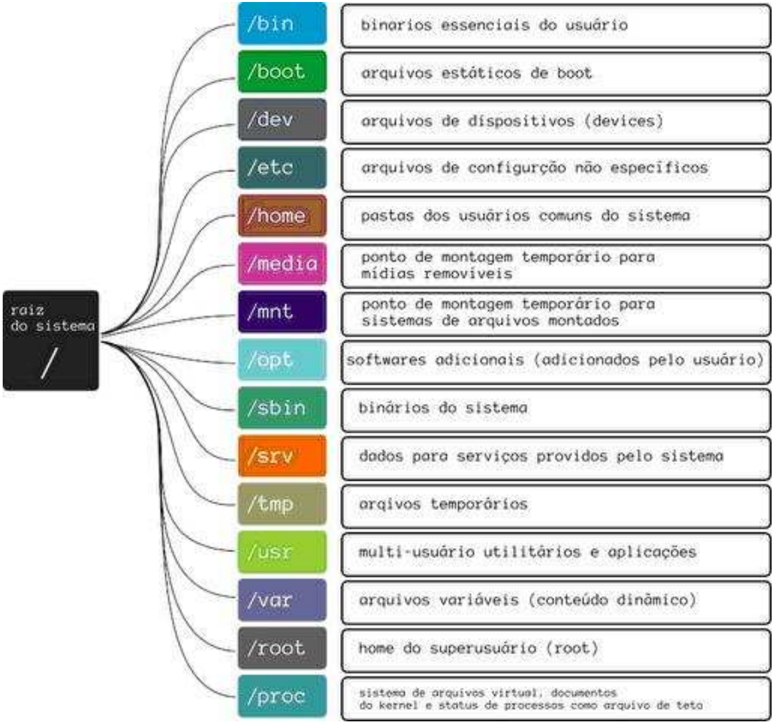

## 23

## FHS, Hierarquia dos Diretórios

## Introdução teórica

Quem já teve algum contato com o GNU/Linux , mesmo que superficial, deve ter percebido a presença de vários diretórios (pastas) no sistema. Entretanto, eles estão organizados seguindo o padrão POSIX , com o qual você pode não estar muito familiarizado. Neste capítulo, vamos conhecer a organização, e explorar a estrutura de diretórios de um sistema GNU/Linux .

Desde que o GNU/Linux foi criado, muito se tem feito para seguir um padrão em relação à estrutura de diretórios. O primeiro esforço para padronização de sistemas de arquivos para o GNU/Linux foi o FSSTND - Filesystem Standard , lançado no ano de 1994.

Cada diretório do sistema tem seus respectivos arquivos que são armazenados conforme regras definidas pela FHS - Filesystem Hierarchy Standard ou Hierarquia Padrão do Sistema de Arquivos , que define que tipo de arquivo deve ser guardado em cada diretório. Isso é muito importante, pois o padrão ajuda a manter compatibilidade entre as distribuições existentes no mercado, permitindo que qualquer software escrito para o GNU/Linux seja executado em qualquer distribuição desenvolvida de acordo com os padrões FHS .

Atualmente, o FHS está na sua versão 2.3, e é mantido pelo Free Standard Group , uma organização sem fins lucrativos formada por grandes empresas como HP, IBM, RedHat e Dell.

É vital entender bem sobre a FHS para prova, é através dela que nós devemos fazer nossas atividades com o GNU/Linux em nosso dia-a-dia.

## Estrutura de Diretórios GNU/Linux

A estrutura de diretórios também é conhecida como 'Árvore de Diretórios' porque tem a forma de uma árvore. Mas, antes de estudarmos a estrutura de diretórios, temos que entender o que são diretórios.

Um diretório é o local onde os arquivos são guardados no sistema. O objetivo é organizar os diferentes arquivos e programas. Pense nos diretórios como sendo as gavetas de um armário. Cada gaveta guarda, normalmente, um tipo diferente de roupa, enquanto cada diretório guarda um certo tipo específico de arquivo.

O arquivo pode ser um texto, uma imagem, planilha, etc. Os arquivos devem ser identificados por nomes para que sejam localizados por quem deseja utilizá-los.

Um detalhe importante a ser observado é que o GNU/Linux segue o padrão POSIX que é case sensitive , isto é, ele diferencia letras maiúsculas e minúsculas nos arquivos e diretórios.

Sendo assim, um arquivo chamado Joatham é diferente de um outro chamado JOATHAM e diferente de um terceiro, chamado joatham . Inteligente isso, não é?

A árvore de diretórios do GNU/Linux tem a seguinte estrutura:



A seguir segue uma listagem da estrutura padrão dos diretórios e o que contém em cada um deles.

- /bin : comandos (binários) essenciais acessíveis a qualquer usuário;
- /sbin : comandos (binários) essenciais administrativos;
- /boot : arquivos estáticos do gerenciador de inicialização e imagem do kernel;
- /dev : arquivos dispositivos (discos rígidos, placa de som, placa de vídeo, mouse, etc., exceto placa de rede);
- /etc : arquivos de configuração de sistema e de programas em geral;
- /lib : bibliotecas essenciais do sistema;
- /media : ponto de montagem para dispositivos removíveis;
- /mnt : ponto de montagem para sistemas de arquivos temporários;
- /opt : pacotes de software adicionais (proprietários);
- /srv : dados providos por serviços de rede do sistema;
- /var : dados variáveis (por exemplo: arquivos de log, cache, spool de impressão etc.);

- /home : diretórios pessoais dos usuários;
- /root : diretório pessoal do usuário root ;
- /usr : hierarquia secundária. É chamado de hierarquia secundária pois é o maior diretório do sistema após o diretório raiz. Todos os subdiretórios em localizados dentro do diretório /usr não são essenciais e tem uma estrutura muito parecida com / do sistema:
- /usr/sbin : binários administrativos não essenciais;
- /usr/bin : binários não essenciais;
- /usr/lib : bibliotecas não essenciais ao sistema;
- /usr/share/man : documentações (manuais);
- /usr/src : códigos-fonte, por exemplo: do kernel
- /proc : armazena informações dinâmicas sobre o sistema operacional, como, processos, informações sobre entrada e saída, interrupções, modelo do processador, versão do kernel, estatísticas sobre quanto tempo a máquina está ligada, quais sistemas de arquivos suportados etc. Este diretório não existe no disco rígido e sim na memória RAM;
- /sys : sistema de arquivos virtual como o /proc mas que armazena e permite modificações nos dispositivos conectados ao sistema;
- /lost+found : armazena arquivos recuperados pelo sistema;
- /run : informações sobre o sistema em execução desde o último boot, usuários logados e processos servidores em execução;
- /tmp : arquivos temporários que são limpos durante a inicialização;

## Diretório /

ls --color /

```
A opção --color do comando ls serve para deixar colorido a listagem, ex: * Azul -> Diretório. * Branco -> Arquivo regular. * Verde -> Arquivo executável. * Azul claro -> Link simbólico. * Vermelho -> Arquivo compactado. * Rosa -> Imagem.
```

Este é o principal diretório do GNU/Linux , e é representado por uma / (barra). É no diretório raiz que ficam todos os demais diretórios do sistema. Estes diretórios, que vamos conhecer agora, são chamados de subdiretórios pois estão dentro do diretório / .

## Diretório /bin

ls /bin

O diretório /bin guarda os comandos essenciais para o funcionamento do sistema.

Esse é um diretório público, sendo assim, os comandos que estão nele podem ser utilizados por qualquer usuário do sistema. Entre os comandos, estão: * /bin/ls ; * /bin/cp ; * /bin/mkdir ; * /bin/cat ;

Qualquer usuário pode executar estes comandos:

```
┌ --(joathamkali)-[~] `-$ /bin/ls /boot/grub┌ --(rootkali)-[/home/joatham] `-# /bin/ls /boot/grub
```

## Diretório /boot

ls /boot

No diretório /boot estão os arquivos estáticos necessários à inicialização do sistema, e o gerenciador de boot . O gerenciador de boot é um programa que permite escolher e carregar o sistema operacional que será iniciado.

## Diretório /dev

ls /dev

No diretório /dev ficam todos os arquivos de dispositivos. O GNU/Linux faz a comunicação com os periféricos por meio de links especiais que ficam armazenados nesse diretório, facilitando assim o acesso aos mesmos.

Para verificar que seu mouse é reconhecido como um arquivo, tente olhar o conteúdo do arquivo /dev/input/mice :

cat /dev/input/mice

Repare que os dados são binários e não é possível ler o arquivo com o comando cat . Caso seu terminal fique com caracteres estranhos utilize o comando reset para resetar o shell:

reset

Para visualizar o conteúdo do arquivo /dev/input/mice execute o comando od que é utilizado para visualizar o conteúdo de um arquivo nos formatos: hexadecimal , octal , ASCII e nome dos caracteres. Este comando pode ser útil para um programador que deseja criar um programa conforme o movimento do mouse.

od /dev/input/mice

Observe o conteúdo do seu HD:

hexdump /dev/sda

O comando hexdump tambem é utilizado para visualizar o conteúdo de um arquivo nos formatos: hexadecimal , octal , decimal , ASCII .

## Diretório /etc

ls /etc

No diretório /etc estão os arquivos de configuração do sistema. Nesse diretório vamos encontrar vários arquivos de configuração, tais como: scripts de inicialização do sistema, tabela do sistema de arquivos, configuração padrão para logins dos usuários, etc.

cat /etc/passwd

Vamos pegar uma linha de exemplo:

joatham:x:1000:1000:joatham:/home/joatham:/bin/bash

Vamos dividir esta linha em campos , onde cada campo é separado por : (dois pontos), então:

| Campo           | Significado                                                                                                                                                             |
|-----------------|-------------------------------------------------------------------------------------------------------------------------------------------------------------------------|
| joatham x       | Login do Usuario Aqui diz que a senha esta no arquivo /etc/shadow . Se estivesse *, a conta estaria desabilitada e se estivesse sem nada (::), a conta nao teria senha. |
| 1000            | UID (User IDentification) , o numero de identificacao do usuario.                                                                                                       |
| 1000            | GID (Group IDentification) , o numero de identificacao do grupo do usuario.                                                                                             |
| joatham         | GECOS Comentarios do usuario, como nome, telefone e etc.                                                                                                                |
| /home- /joatham | O diretorio HOME do usuario.                                                                                                                                            |
| /bin/bash       | Shell do usuario, ou seja, o programa que ira interpretar os comandos que o usuario executar.                                                                           |

Vamos conhecer o arquivo /etc/shadow :

more /etc/shadow

O comando more assim como o cat serve para ver o conteúdo de um arquivo que é, geralmente, texto. A diferença entre o more e o cat é que o more faz uma pausa a cada tela cheia exibindo uma mensagem --More , dando uma oportunidade ao usuário ler a tela.

Aperte enter para ir para a próxima linha ou espaço para ir para a próxima página e para sair digite q .

Uma alternativa ao uso do comando more seria o uso do comando less , que implementa as mesmas funcionalidades que more e mais algumas, como a possibilidade de rolar a tela para

cima e para o lado quando o texto ocupa mais de oitenta colunas .

A utilização dos comandos less e more se faz de maneira semelhante.

less /etc/shadow

Vamos pegar uma linha de exemplo:

```
joatham:$1$Tcnt$Eisi0J9Wh3fCEsz1:11983:0:99999:7:30::
```

Este arquivo possui as senhas criptografadas dos usuários do sistema. Existe uma entada no arquivo para cada usuário do sistema com os seguintes campos:

| Campo                                          | Significado                                                                                                                                                                 |
|------------------------------------------------|-----------------------------------------------------------------------------------------------------------------------------------------------------------------------------|
| joatham                                        | Login do Usuario.                                                                                                                                                           |
| 1 Tcnt$Eisi0J9Wh3fCEsz1 A senha criptografada. | 1 Tcnt$Eisi0J9Wh3fCEsz1 A senha criptografada.                                                                                                                              |
| 11983                                          | O numero de dias que existem de 01/01/1970 ate a data da ultima modificacao da senha.                                                                                       |
| 0                                              | Numero de dias antes do sistema permitir uma nova modificacao na senha.                                                                                                     |
| 99999                                          | Numero maximo de dias que o usuario pode ficar com uma mesma senha                                                                                                          |
| 7                                              | Numero de dias, antes da expiracao da senha, quando o usuario e informado da necessidade de alterar a senha.                                                                |
| 30                                             | Numero de dias apos a expiracao da senha, quando a conta passa a ser considerada inativa (o valor -1 significa que a conta fica inativa no mesmo dia da data de expiracao). |

| Campo                                                                                                                                                  | Significado   |
|--------------------------------------------------------------------------------------------------------------------------------------------------------|---------------|
| Numero de dias que existem de 01/01/1970 ate a expiracao da senha (o valor -1 significa que nao ha data de expiracao). campo reservado para uso futuro |               |

Apenas o usuário root (administrador do sistema) tem permissão para acessar o arquivo /etc/shadow .

Ocomando pwconv é usado para criar o arquivo shadow a partir do arquivo /etc/passwd , enquanto o comando pwunconv executa a operação inversa. Execute:

```
pwunconv
```

Verifique que não existe mais o arquivo /etc/shadow :

```
cat /etc/shadow
```

Verifique que as senhas criptografadas estão agora no arquivo /etc/passwd através do comando getent :

```
getent passwd
```

Para voltar as senhas criptografadas, execute:

```
pwconv
```

Agora as senhas estão protegidas novamente!! Antigamente estes comandos eram utilizados para sistemas que não vinham com as senhas protegidas no /etc/shadow por padrão, hoje em dia praticamente todas as distribuições trazem o arquivo como padrão, então utilizamos o comando para execução de scripts para facilitar a captura de senhas, como por exemplo a migração de um servidor de e-mail, onde queremos manter a senha antiga do usuário

## Diretório /lib

ls /lib

No diretório /lib estão as bibliotecas compartilhadas e módulos do kernel. As bibliotecas são funções que podem ser utilizadas por vários programas.

Cada kernel têm seus próprios módulos, que ficam em: /lib/modules/&lt;versão do kernel&gt;/kernel Separados por tipos em subdiretórios.

Para saber sua versão do kernel execute:

uname -r

Para visualizar os tipos de módulos:

ls /lib/modules/$(uname -r)/kernel

## Diretório /media

ls /media

Ponto de montagem para dispositivos removíveis, tais como:

- hd
- cd
- dvd
- pendrive
- cameras

## Diretório /mnt

ls /mnt

Este diretório é utilizado para montagem temporária de sistemas de arquivos, tais como compartilhamentos de arquivos entre Windows e GNU/Linux , GNU/Linux e GNU/Linux , etc.

## Diretório /opt

ls /opt

Normalmente, é utilizado por programas proprietários ou que não fazem parte oficialmente da distribuição.

## Diretório /sbin

ls /sbin

O diretório /sbin guarda os comandos utilizados para inicializar, reparar, restaurar e/ou recuperar o sistema. Isso quer dizer que esse diretório também contém comandos essenciais, mas os mesmos são utilizados apenas pelo usuário administrador root .

Entre os comandos estão:

- hatl
- ifconfig
- init
- iptables

Os usuários comuns não podem executar comandos do /sbin que alterem o sistema, apenas alguns para visualização.

Exemplo: Visualizar IP configurado na placa eth0 :

```
┌ --(joathamkali)-[~] `-$ /sbin/ifconfig eth0
```

## Criar uma alias da interface eth0

```
┌ --(joathamkali)-[~] `-$ /sbin/ifconfig eth0:1 10.10.10.10
```

## Diretório /srv

ls /srv

Diretório para dados de serviços fornecidos pelo sistema, cuja aplicação é de alcance geral, ou seja, os dados não são específicos de um usuário. Por exemplo:

- /srv/www (servidor web)
- /srv/ftp (servidor ftp)

## Diretório /tmp

ls /tmp

Diretório para armazenamento de arquivos temporários. É utilizado principalmente para guardar pequenas informações que precisam estar em algum lugar até que a operação seja completada, como é o caso de um download .

Enquanto não for concluído, o arquivo fica registrado em /tmp , e, assim que é finalizado, é encaminhado para o local correto.

## Diretório /usr

ls /usr

O diretório /usr contém programas que não são essenciais ao sistema e que seguem o padrão GNU/Linux , como, por exemplo, navegadores, gerenciadores de janelas, etc.

## Diretório /var

ls /var

O diretório /var contém arquivos de dados variáveis. Por padrão, os programas que geram arquivos de registro para consulta, mais conhecidos como logs , ficam armazenados nesse diretório. Além do log , os arquivos que estão aguardando em filas, também ficam localizados em /var/spool .

Os principais arquivos que se utilizam do diretório /var são:

- Mensagens de e-mail
- Arquivos a serem impressos

ls /var/spool

- Arquivos de logs

ls /var/log

## Diretório /proc

ls /proc

O /proc é um diretório virtual, mantido pelo kernel, onde encontramos a configuração atual do sistema, dados estatísticos, dispositivos já montados, interrupções, endereços e estados das portas físicas, dados sobre as redes, etc.

Utilize os paginadores more ou less para visualizar alguns arquivos:

more /proc/cpuinfo

## Diretório /sys

ls /sys

Pode-se dizer que esse diretório é um primo do diretório /proc . Dentro do diretório /sys podemos encontrar o quase o mesmo conteúdo do /proc , mas de uma forma bem mais organizada para nós administradores.

## Diretórios /home e /root

ls /home /root

Os diretórios /root e /home podem estar disponíveis no sistema, mas não precisam obrigatoriamente possuir este nome. Por exemplo, o diretório /home poderia se chamar /casa , que não causaria nenhum impacto na estrutura do sistema.

O /home contém os diretórios pessoais dos usuários cadastrados no sistema.

O /root é o diretório pessoal do super usuário root .

Como sabemos o root é o administrador do sistema, e pode alterar as configurações do sistema, configurar interfaces de rede, manipular usuários e grupos, alterar a prioridade dos processos, entre outras.

Dica : Utilize uma conta de usuário normal em vez da conta root para operar seu sistema.

Uma razão para evitar usar privilégios root regularmente, é a facilidade de se cometer danos irreparáveis; além do que, você pode ser enganado e rodar um programa Malware (programa que obtém poderes do super usuário) comprometendo a segurança do seu sistema sem que você saiba.