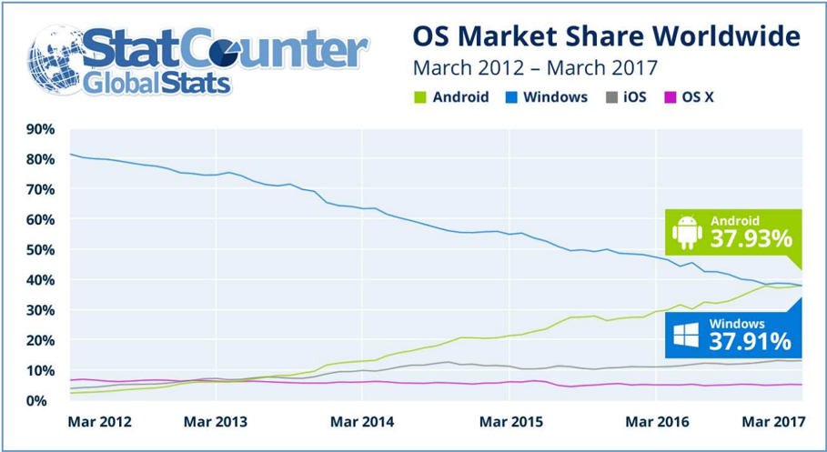
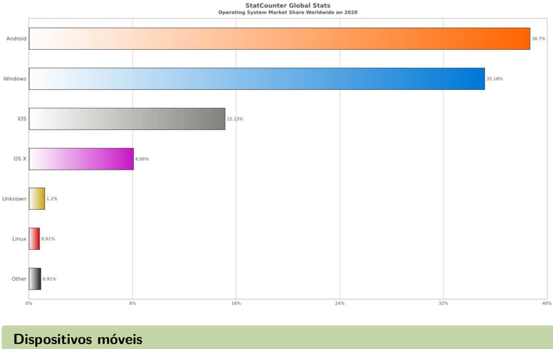
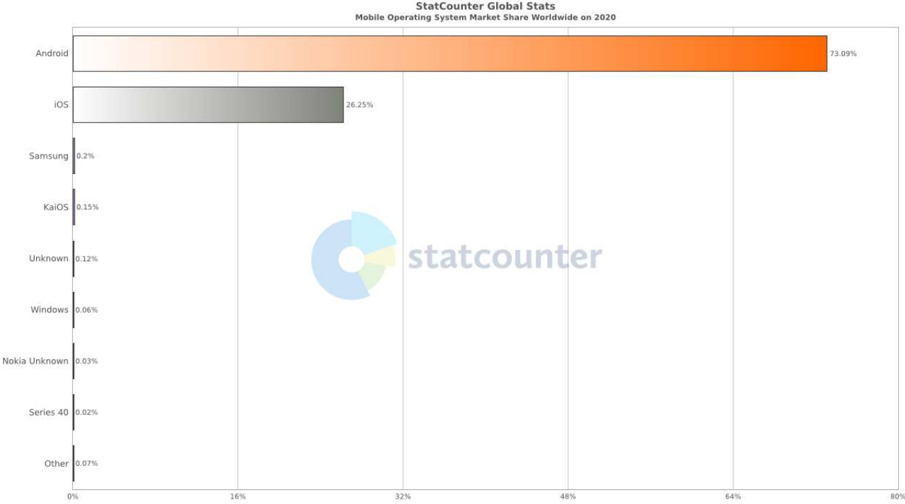
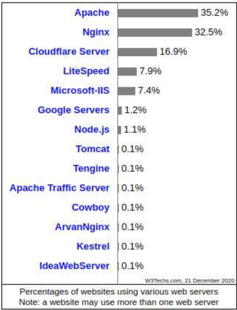
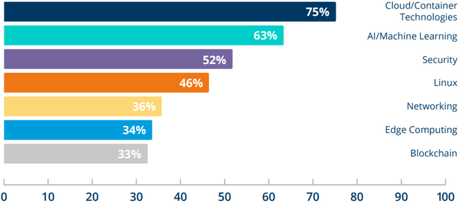

## 1

## Introdução ao Linux

## Sobre o material

Existem basicamente dois tipos de materiais de estudo: os materiais de referência e os tutoriais. O material de referência é orientado para a consulta por quem já conhece um assunto e precisa apenas relembrar ou necessita apenas de detalhes mais específicos sobre um tópico, como por exemplo, a sintaxe de um comando. Já o material do tipo tutorial visa ensinar um conceito ou assunto. Ele tenta ensinar a quem não sabe como fazer algo, como usar os recursos e as ferramentas disponíveis para atingir um determinado resultado. Ambos são muito importantes e úteis tanto para o estudante quanto para o profissional. Ambos servem para consulta futura, pois enquanto o material de referência será acessado com mais frequência depois de acabada a etapa inicial de aprendizado, existem inúmeras maneiras diferentes de se apresentar um assunto, refletindo as variações existentes no mundo real. Então, mesmo quem já domina determinado assunto irá se beneficiar por estudar um novo tutorial de vez em quando. Fora o fato de que podemos 'esquecer' determinadas coisas se ficarmos algum tempo sem utilizá-las, então talvez seja necessário voltar aos tutoriais para relembrar. As apostilas deste curso são tutoriais. Não iremos apresentar todas as variações de sintaxe de um comando nem todas as diretivas de um arquivo de configuração. Isto é informação de referência, que é melhor atendida pelas suas respectivas documentações oficiais.

Acreditamos que o aluno não tem necessidade de 'mais um' material de referência para

Linux. Já existem materiais muito bons, disponíveis gratuitamente, mas acreditamos que podemos fazer a diferença com uma forma diferente de fazer tutoriais. Tentaremos seguir uma abordagem de 'aprender fazendo', privilegiando exemplos de exercícios completos, que o aluno pode executar imediatamente.

Esperamos que o aluno aprenda pela leitura e análise destes exemplos. Ainda assim, é importante complementar o material nestas apostilas com as referências apresentadas no nosso ambiente virtual de ensino.

Também não temos a pretensão de escrever o 'melhor tutorial do mundo'. Cada pessoa tem sua própria forma de ver o mundo e de aprender sobre os assuntos. Por isso indicaremos, no material complementar, alguns outros tutoriais que serão úteis durante ou depois do curso para solidificar o seu entendimento do Linux.

## Mercado Linux

Nesta seção, você será introduzido no mundo Open Source, veremos a importância do Linux no mundo atual e quais são as principais profissões do mercado que utilizam Linux atualmente. Logo, vamos responder a perguntas como:

- Onde podemos encontrar o Linux?
- Por onde posso começar usando o Linux?
- Quais as principais profissões envolvendo Linux?

'Se o Windows domina no Desktop. . . o Linux domina o mundo!' Steve Ranger ZDnet

## Onde podemos encontrar o Linux?

Atualmente, muitos nichos no mundo de tecnologia utilizam o Linux, começando pelo mercado de dispositivos móveis. Hoje o Android é o sistema operacional para dispositivos móveis mais utilizado no mundo. Não podemos deixar de falar sobre o mundo de segurança, testes de invasão ou técnicas forenses sem conhecer Linux, pois muitas das ferramentas utilizadas nesse ramo foram desenvolvidas para as distribuições Linux.

Hoje a computação em nuvem vem transformando muitos dos recursos tecnológicos das empresas em serviços prestados por provedores, nesses casos podendo fornecer, por exemplo, infraestrutura sob demanda e a maior parte dos recursos que estão hoje na computação em nuvem são executados em ambientes Linux. Grandes provedores de serviços em nuvem, como Amazon Web Services (AWS), Google Cloud Platform (GCP), Oracle Cloud (OCI) e Digi-

tal Ocean oferecem diferentes distribuições Linux e até mesmo a Microsoft oferece máquinas virtuais baseadas em Linux em sua nuvem, chamada Azure.

O mundo da Big Data também vem crescendo e atualmente as ferramentas para integração e tratamento de dados são executados em Linux.

A DevOps é uma cultura aplicada para se obter principalmente a união entre os times de desenvolvimento (dev) e operações (ops) e assim surgiram diversas operações e deveres de ambas as áreas, muito disso funcionando dentro de ambientes Linux.

## Market Share - Sistemas Operacionais pelo mundo

Em Março de 2017, a StatCounter anunciou o novo sistema operacional mais utilizado no mundo (levando em consideração apenas sistemas conectados à Internet).

O Android é um sistema operacional baseado no kernel Linux, licenciado pelo GPLv2.

'Este é um marco na história da tecnologia e o fim de uma era', comentou Aodhan Cullen, CEO da StatCounter. 'Isso marca o fim da liderança mundial da Microsoft no mercado de sistemas operacionais, que detém desde os anos 1980. Também representa um grande avanço para o Android, que detinha apenas 2,4% do uso global da Internet há apenas cinco anos.'

Atualmente, o Android é o sistema operacional móvel mais utilizado no mundo (considerando apenas sistemas conectados à Internet). Logo abaixo, temos um gráfico referente ao ano de 2020:

Esse grande domínio do sistema operacional Android deve-se aos dispositivos móveis como os smartphones. Abaixo temos um gráfico referente ao ano de 2020 para esses dispositivos:

Conheça mais estatísticas em: https://gs.statcounter.com/.

## Desktop Linux

Atualmente, o Linux ocupa cerca de 2% dos desktops. Mesmo não dominando os computadores domésticos, ainda são desenvolvidas diversas distribuições para a utilização do usuário comum, muitas delas são até mesmo mais simples do que o próprio sistema de janelas da Microsoft.

Ainda que as estações de trabalho não sejam muito utilizadas, a comunidade vem desenvolvendo interfaces cada vez mais amigáveis. A seguir temos uma breve listagem:

- Elementary OS
- MX Linux
- Linux Mint
- Deepin
- Manjaro OS
- Pop!\_OS
- Ubuntu
- Fedora

Conheça as distribuições mais utilizadas em: https://distrowatch.com.

## Servidores web

Em 2020, a W3Techs fez o relatório de Market Share dos servidores web mais utilizados baseado nos sistemas operacionais:

## Profissões no mundo OpenSource

Alguns dados sobre o relatório de vagas de trabalho no mercado do código aberto em 2020 gerado pela Linux Foundation e pela edX:

- Cerca de 93% dos gerentes de contratação relatam dificuldade em encontrar talentos na área de código aberto e 63% dizem que suas organizações começaram a apoiar projetos de código aberto com contribuições sob a forma de código ou outros recursos pelo motivo explícito de recrutar indivíduos com essas habilidades de software, um salto significativo dos 48% conhecidos em 2018. DevOps também se tornou a principal função que os gerentes de contratação estão procurando preencher (65% estão procurando contratar talentos DevOps), movendo a demanda por desenvolvedores para o segundo lugar.
- Pela primeira vez na história deste relatório, 74% dos empregadores agora estão se

oferecendo para pagar pelas certificações de seus funcionários.

- As certificações crescem em importância: 52% dos gerentes de contratação são mais propensos a contratar alguém com uma certificação, contra 47% há dois anos.
- A tecnologia de nuvem está aquecida: em termos de domínio de conhecimento, os gerentes de contratação relatam que conhecimentos em tecnologias de nuvem aberta tem o impacto mais significativo, e 70% deles está mais propenso a contratar um profissional com essas habilidades, contra 66% em 2018.

Tecnologias da mais alta importância para profissionais de código aberto em 2020:

Alguns dos muitos cargos que estão em alta no mundo Open Source:

- Analista DevOps
- Analista SRE
- Administrador de Servidores
- Desenvolvedor de Software
- Engenheiro de Software
- Analista de Banco de Dados
- Engenheiro de Dados
- Cientista de Dados
- Engenheiro de Machine Learning
- Analista de Segurança
- Gerente de TI
- Diretor Chefe de Tecnologia