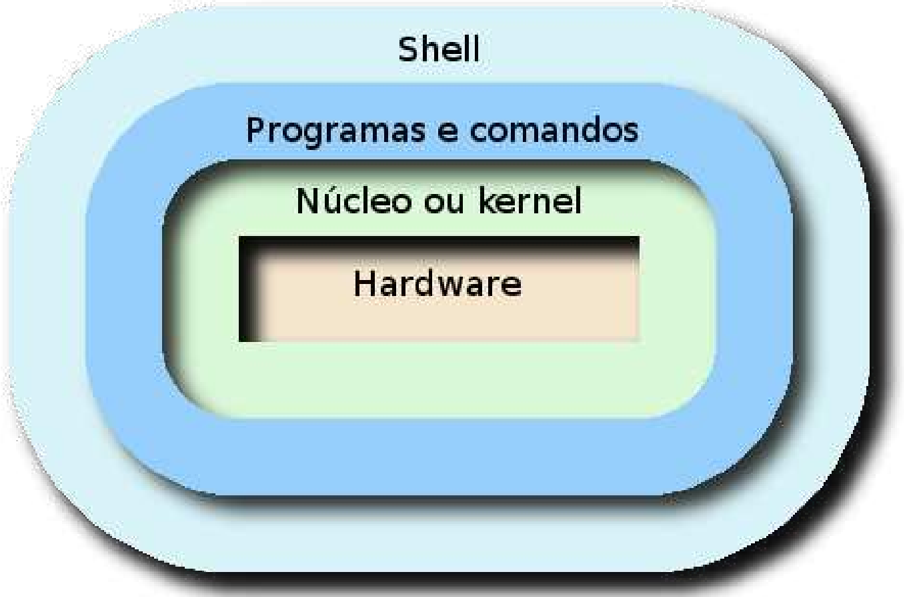

## 9

## O que é um Shell

Sabemos que o principal meio de interação do usuário com um sistema GNU/Linux é o terminal de comandos, também conhecida como shell . Portanto e possível afirmar que o shell é uma camada de acesso ao sistema básico, o sistema operacional do computador, que pode ser acessada tanto pelo modo gráfico, quanto pelo modo texto. O shell pode ser personalizado para atender as necessidade do usuário.

Pode-se definir um idioma padrão, personalizar e automatizar processos. Nos tópicos a seguir, veremos como fazer essa personalização. A figura abaixo ilustra como podemos posicionar a shell dentro do sistema.

## Tipos de shell

Há diversos tipos de shell disponíveis para distribuições GNU/Linux . O bash é o tipo utilizado na maioria das distribuições. A seguir, temos a descrição dos principais tipos de shell:

- sh (Bourne shell) : desenvolvido por Stephen Bourne, por isso seu nome. É o shell original, bem simples, com poucas ferramentas, mas ainda utilizado em sistemas UNIX e ambientes relacionados ao UNIX.
- bash (Bourne Again shell) : trata-se do shell padrão do Linux, conveniente tanto para usuários iniciantes, por ser intuitivo e flexível, quanto para usuários avançados e profissionais, por possuir ferramentas variadas e eficientes. Compatível com todos os comandos do sh .
- csh (C shell) : o preferido de alguns programadores. A sintaxe desse shell é semelhante à linguagem de programação C.
- tcsh (Turbo C shell) : versão melhorada do csh , que interpreta linguagens de comando e pode ser usada tanto como um shell de login interativo quanto como um processador de comandos de shell scripts. É completamente compatível com o csh .
- ksh (Korn shell) : este shell é o Bourne Shell evoluído, portando todos os comandos que funcionavam no Bourne Shell funcionarão aqui, com a vantagem de ter mais opções.

- zsh (Z shell) : além de um shell desenvolvido para uso interativo, que engloba várias funções úteis do bash , ksh e tcsh , o zsh é também uma linguagem de script eficiente.

## Alteração do shell atual

Para alterar o shell atual, utilizamos o comando chsh com a opção -s ou --shell , seguido do nome do shell que se deseja utilizar.

A linha a seguir altera o shell para o sh :

chsh -s /bin/sh