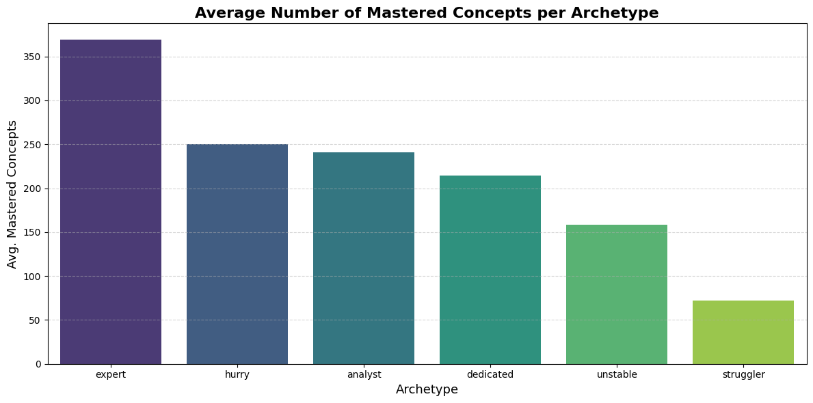

# Simulação de estudantes + Perfis Cognitivos + Treino sintético do SINKT

Esse relatório apresenta o desenvolvimento de um dataset sintético que busca reduzir o problema de **cold start** (início sem dados) em cursos novos. Para isso foram criados:
- Pefis coerentes.
- Um dataset representando as respostas de 500 alunos com 80 respostas cada (aumentei o número referente ao pedido no card para usar no treinamento da GRU).
- Uma arquitetura para usar esses dados criados com a GRU (porém mesmo testando três arquiteturas, o modelo continou prevendo/chutando, ou seja, probabilidade de acertar/errar = 0.5).

**Resposta sobre as questões levantadas**
- **Quais fatores realmente influenciam o aprendizado?**: Segundo minha análise todos os fatores propostos influenciam no aprendizado, porém dentre eles destaco: **domínio prévio** e **velocidade de aprendizado**.

- **Quais fatores fazem sentido e devem ser modelados?**: Acredito que somente **idade** e **classe social**, pois possuem um impacto comprovado no cotidiano das pessoas, enquanto os outros fatores possuem um viés discriminativo.
- **Como garantir uma boa acurácia sem dados reais?:** A modelagem dos dados sintéticos devem ser com a maior qualidade possível, por isso busco implementar um dataset que considera a evolução do aluno. Em um cenário real, alunos se desenvolvem após responder questões, sendo errando ou acertando, o que faz terem mais chances de acertar uma questão daquele mesmo conceito posteriormente.
- **Como validar se os dados sintéticos parecem humanos**: Inserir a maior diversidade possível, de forma balanceada. Posteriormente quando adquirir alguns poucos dados humanos, realizar uma comparação justa e alinhar caso hajam divergências discrepantes.

## 1. Perfis cognitivos

Os perfis podem ser encontrados no módulo ``SINKT.student``. São 6 perfis:
- **Esforçado**: Mediano, porém persistente, aprende de forma constante.
- **Expert**: Já possui um conhecimento inicial grande, acerta muito, aprende rápido.
- **Lutador**:  Aprende devagar, erra muito e possui baixo conhecimento inicial 
- **Analista**: Cuidadoso, aprendizado não tão rápido mas preciso.
- **Descuidado/Apressado**: Rápido, chuta bastante, porém aprende pouco.
- **Instável**: Às vezes bom, às vezes não.

```json
{
"analyst": {
    "initial_proficiency": 0.22,
    "slip_rate": 0.07,
    "guess_rate": 0.2,
    "learning_speed": 2, # 2x
    "technological_familiarity": 0.65,
    "logical_ability": 0.9,
    "text_interpretation": 0.8
},

"unstable": {
    "initial_proficiency": 0.18,
    "slip_rate": 0.25,
    "guess_rate": 0.1,
    "learning_speed": 1,
    "technological_familiarity": 0.5,
    "logical_ability": 0.4,
    "text_interpretation": 0.5
},

"hurry": {
    "initial_proficiency": 0.19,
    "slip_rate": 0.28,
    "guess_rate": 0.08,
    "learning_speed": 0.7,
    "technological_familiarity": 0.7,
    "logical_ability": 0.5,
    "text_interpretation": 0.55
},

"expert": {
    "initial_proficiency": 0.55,
    "slip_rate": 0.05,
    "guess_rate": 0.3,
    "learning_speed": 2.5,
    "technological_familiarity": 0.85,
    "logical_ability": 0.95,
    "text_interpretation": 0.85
},

"dedicated": {
    "initial_proficiency": 0.25,
    "slip_rate": 0.12,
    "guess_rate": 0.18,
    "learning_speed": 1.5,
    "technological_familiarity": 0.6,
    "logical_ability": 0.7,
    "text_interpretation": 0.7
},

"struggler": {
    "initial_proficiency": 0.09,
    "slip_rate": 0.22,
    "guess_rate": 0.1,
    "learning_speed": 0.8,
    "technological_familiarity": 0.35,
    "logical_ability": 0.25,
    "text_interpretation": 0.3
}
}

```


---

## 2. Simulação de estudantes

Seguindo a lógica da implementação realizada na primeira fase do projeto, a GRU, os dados sintéticos foram gerados de forma probabilística, utilizando os perfis definidos anteriormente. Os parâmetros que diferenciam entre cada perfil são: ``slip_rate``, ``technological_familiarity``, ``guess_rate``, ``learning_speed``, ``logical_ability``, ``text_interpretation`` e ``initial_proficiency``. Como as imagens abaixo demonstram, o expert possui maior sucesso de acerto, porém sua maestria aumenta menos em relação aos outros (visto que já sabe muito). Isso é provado no último grafo, demonstrando que o mesmo arquétipo é o que mais possui conceitos desbloqueados.




Por fim foi gerado o arquivo ``synthetic_student_population.csv``, que é usado posteriormente para o treinamento do SINKT.

---

## 3. Treinamento do SINKT

Evoluímos de um modelo de regressão simples para uma arquitetura híbrida de Deep Learning, porém todos apresentaram resultados ruins: o modelo estava apenas chutando 0.5.

**Fontes de Dados:**

1. **Grafo de Conhecimento (gerado na atividade anterior):** Conceitos (Nós), Questões (Nós), Relações de Pré-requisito (Arestas) e Relações "Testado Por" (Arestas).

2. **Traços dos Alunos (CSV):** Dados sequenciais contendo respostas dos alunos (`outcome`) e características auxiliares (ex: `learning_speed` [velocidade de aprendizado], `slip_rate` [taxa de deslize], `archetype` [arquétipo]).


### O Modelo Híbrido GNN-GRU

* **Componente A: Rede Neural em Grafo (GNN)**

  * **Biblioteca:** PyTorch Geometric.

  * **Tipo:** GNN Heterogênea usando camadas `SAGEConv`.

  * **Função:** Recebe a estrutura estática do Grafo de Conhecimento. Aprende um "Embedding Inteligente" para cada questão com base em seus pré-requisitos e conceitos relacionados.

  * **Por que:** Para garantir que o modelo saiba que a "Questão A" está matematicamente relacionada ao "Conceito B", mesmo antes de ver os dados dos alunos.

* **Componente B: Rede Neural Recorrente (GRU)**

  * **Entrada:** Concatenação de [Embedding da Questão via GNN] + [Features Auxiliares do Aluno].

  * **Função:** Processa a sequência de interações do aluno para modelar a mudança temporal no estado de conhecimento.

  * **Saída:** Probabilidade de resposta correta no passo $t+1$.

### Status Atual e Detalhes de Implementação

* **`StudentDataset`:** Lida com o carregamento do CSV, agrupamento por aluno e mapeamento de IDs de string específicos (`specific_concept_id`) para índices inteiros.

* **`build_graph_data`:** Converte modelos de grafo Pydantic em tensores `HeteroData`.

* **Tratamento de IDs:** Implementado um deslocamento de `+1` para os índices das questões para reservar estritamente o Índice `0` para preenchimento (padding).


### O Problema: Perda "Travada"

Apesar de um pipeline funcional, as métricas de treinamento mostraram falta de convergência:

```bash
Epoch 26 | Train Loss: 0.6719 | Val Loss: 0.6743 ... Epoch 45 | Train Loss: 0.6684 | Val Loss: 0.6745
```
A perda (loss) do modelo está consistentemente oscilando em torno de **0.67 - 0.69**.
Este número específico vem da fórmula de **Entropia Cruzada Binária (BCE)**.

$$
Loss = -[y \cdot \ln(p) + (1 - y) \cdot \ln(1 - p)]
$$

Se um modelo não treinado prevê uma probabilidade de **0.5 (50%)** para cada amostra (adivinhação pura), a perda se torna:

$$
Loss = -\ln(0.5) = \ln(2) \approx \mathbf{0.693}
$$

#### Causas Raiz

1. **Falha de Sinal:** O modelo não conseguiu encontrar nenhum padrão no grafo ou nas features que seja forte o suficiente para empurrar as previsões para longe da "aposta segura" de 0.5.

2. **Ruído de Inicialização Aleatória:** A GNN começa com pesos aleatórios. Se o sinal do grafo for fraco, a GNN emite "ruído suavizado", o que confunde a GRU.

3. **Sobrecarga de Features:** Concatenar features auxiliares brutas (como `slip_rate`) com embeddings pode estar afogando o sinal se as features não forem perfeitamente normalizadas ou relevantes.